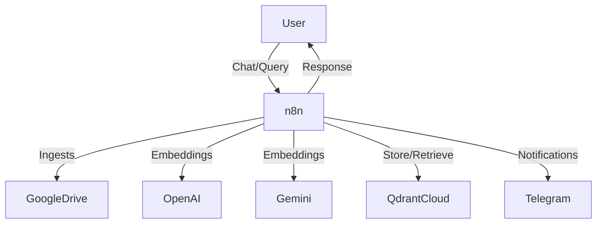

# 🧠 AI-Powered RAG Chatbot for Dynamic Document Intelligence

---

## 🚀 Overview

This repository introduces a robust, production-ready AI-powered Retrieval-Augmented Generation (RAG) chatbot workflow. Built with n8n for orchestration, Google Drive for document management, Google Gemini (PaLM) and OpenAI for advanced language capabilities, and Qdrant Cloud for efficient vector search, this solution transforms how users interact with their documents. It enables seamless, context-aware conversations by grounding responses in the most current and relevant information, overcoming the limitations of static Large Language Model (LLM) knowledge.

---

## ✨ Key Features

- **Intelligent Document Ingestion:** Automated fetching and processing of documents directly from Google Drive, ensuring your knowledge base is always up to date.
- **Sophisticated Metadata Extraction & Embeddings:** Utilizes advanced LLMs (OpenAI, Gemini) for precise metadata extraction and high-quality vector embeddings, enabling deep semantic understanding.
- **Optimized Vector Storage & Retrieval:** Employs Qdrant Cloud for scalable, lightning-fast storage and retrieval of document vectors, powering efficient semantic search.
- **Dynamic Conversational AI:** A natural language chat interface, powered by Gemini and OpenAI, delivers contextually rich and highly relevant responses.
- **Human-in-the-Loop Safeguards:** Integrates Telegram for critical operational approvals (such as vector deletions), ensuring data integrity and control.
- **Modular & Extensible Workflow:** Designed with a modular n8n workflow, allowing for easy customization, maintenance, and scalable deployment.

---

## 🏗️ High-Level Architecture

The system’s architecture is meticulously crafted for performance and reliability:

- **n8n:** Serves as the central orchestration engine, seamlessly connecting all integrated services.
- **Google Drive:** Acts as the primary source for all ingested documents, ensuring centralized document management.
- **OpenAI & Google Gemini:** Provide versatile LLM capabilities, handling both advanced natural language understanding and high-fidelity embedding generation.
- **Qdrant Cloud:** The backbone for vector storage and semantic search, delivering rapid and accurate context retrieval.
- **Telegram:** (Optional) Facilitates real-time notifications and enables human oversight for critical workflow decisions.

---

## ⚡ Quick Start Guide

Get your AI-powered RAG chatbot up and running swiftly:

1. **Review SETUP.md:** Begin by checking all prerequisites and following the comprehensive step-by-step setup guide.
2. **Import Workflow:** Load the provided n8n workflow JSON file directly into your n8n instance.
3. **Configure Credentials:** Securely set up all necessary API keys and environment variables for Google, OpenAI, Gemini, Qdrant, and Telegram.
4. **Engage:** Populate your designated Google Drive folder with documents, and start interacting with your intelligent AI chatbot!

---

## 📚 Comprehensive Documentation

- **SETUP.md:** Contains detailed setup instructions, environment variable configurations, and robust testing procedures.
- **TECHNICAL_DOCUMENTATION.md:** Provides an in-depth exploration of the technical approach, intricate workflow design, and core code components.

---
